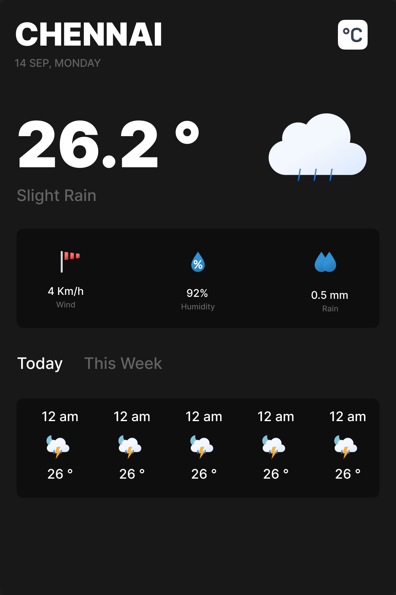

<h3 align="center">Simple Weather App</h3>

  

    Simple Weather app with basic search functionality to display weather conditions.  
     
    <a href="https://notsanta20.github.io/weather_app/" target="_blank">Live Demo</a>
  

 

<!-- ABOUT THE PROJECT -->
### Preview

 

### Built With

<!-- ACKNOWLEDGMENTS -->
## Acknowledgments

* Inspiration by <a href="https://www.theodinproject.com/lessons/node-path-javascript-weather-app" target="_blank">The Odin Project</a>

* <a href="https://open-meteo.com/" target="_blank">Weather API</a>

* <a href="https://api-ninjas.com/" target="_blank">Geocoding API</a>

* <a href="https://github.com/basmilius/weather-icons" target="_blank">Weather Icons</a>

* <a href="https://github.com/Remix-Design/RemixIcon" target="_blank">Icons</a>
